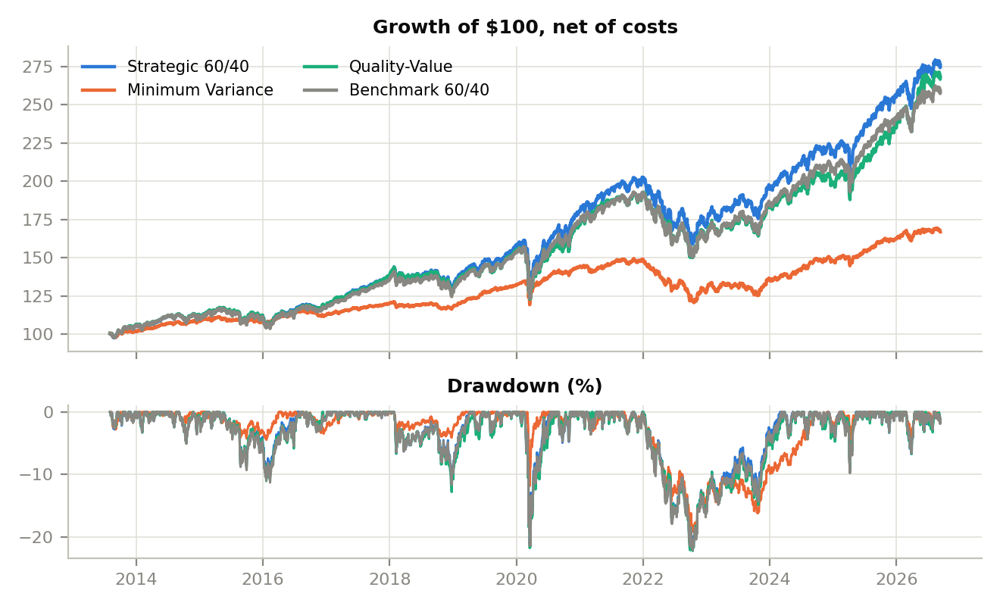

# ETF portfolio construction and risk attribution

> **Live dashboard: https://etf-portfolio-attribution.streamlit.app**
> 
> Methodology: [docs/methodology.md](docs/methodology.md) · Conclusion: [docs/investment_conclusion.md](docs/investment_conclusion.md)



Three multi-asset portfolios built from iShares ETFs, run against a 60/40 benchmark from August
2013 to September 2026, and then taken apart: what they returned, where the risk actually sat,
which decisions produced the difference, and how they behaved when markets broke.

## Why I built it

Most portfolio projects stop at a backtest and a Sharpe ratio. The interesting question starts
after that: given two portfolios that returned roughly the same thing, which decision earned the
difference? Was it the asset mix, the funds chosen inside each sleeve, or a factor exposure that
happened to be in fashion? A performance number cannot answer that. An attribution can.

So the point of this repo is the decomposition, not the backtest. Every portfolio is measured
against the same benchmark, the active return is split daily into allocation, selection and
costs, and the split reconciles to the last basis point before anything is reported.

Two of the three portfolios are deliberately identical except for one sleeve. The strategic 60/40
holds IVV for US equity. The quality-value version replaces it with a 50/50 split of QUAL and
VLUE. Same regional weights, same bonds, same rebalancing rule. Anything that separates them is a
factor effect and nothing else.

## What it found

| | Strategic 60/40 | Minimum Variance | Quality-Value | Benchmark |
|---|---|---|---|---|
| Return p.a. | 8.06% | 3.98% | 7.83% | 7.53% |
| Volatility | 10.1% | 5.4% | 10.3% | 10.2% |
| Sharpe | 0.64 | 0.42 | 0.61 | 0.59 |
| Max drawdown | -21.6% | -19.2% | -22.2% | -22.1% |
| Tracking error | 0.83% | 6.80% | 1.93% | n/a |
| Turnover p.a. | 4.7% | 41.4% | 4.2% | 9.1% |

Four things surprised me.

The 60/40 benchmark holds 60% of its capital in equities and 91% of its risk there. Anyone
describing that portfolio as balanced is describing the cash, not the risk.

Minimum variance ran at half the benchmark's volatility and still drew down 19.2% against its
22.1%. Low volatility bought almost nothing in the drawdown that mattered, because 2022 was a
drawdown in stocks and bonds at the same time, and the optimiser's answer to equity risk was more
duration.

Trading costs are a rounding error at these turnover levels. Five times my cost assumptions takes
one basis point a year off the strategic portfolio. The rebalancing rule, on the other hand, moves
the return by 1.3 percentage points a year and the drawdown by 2 points, which makes rebalancing
policy a risk decision that happens to show up in the performance table.

The quality-value tilt cost 5.0 points of cumulative return over thirteen years and then made 6.1
of them back in the first nine months of 2026. A factor sleeve is a decade-scale position, and
almost nobody holds one for a decade.

The full write-up is in [docs/investment_conclusion.md](docs/investment_conclusion.md), the method
is in [docs/methodology.md](docs/methodology.md).

## How it works

Data lands in one SQLite file. `scripts/fetch_data.py` pulls daily total returns for 25 ETFs back
to 2003 from Yahoo Finance, Treasury yields and the dollar index from the same source, macro series
from FRED, and the line-by-line holdings files from iShares, which is where the sector, country,
currency and duration exposures come from.

`scripts/run_pipeline.py` does the work and writes its results back into the same database as
`res_*` tables.

The backtest drifts weights daily with returns, computes targets from data up to a signal date,
executes at the next close, and charges a one-way cost in basis points per ETF on the weight
actually traded. Minimum variance re-optimises monthly on a Ledoit-Wolf shrunk covariance matrix
with a 25% position cap and a 20% equity floor.

Attribution is Brinson-Fachler computed every day and linked with Carino. The benchmark's own
regional mix is estimated monthly by returns-based style analysis, so allocation can be measured
region by region rather than just equity against bonds. The daily identity is asserted in code:
allocation plus selection plus interaction plus costs plus the benchmark replication residual
equals the active return, every day, or the run fails.

On top of that sit a ten-factor weekly regression, an Euler decomposition of ex-ante risk, look-
through exposures, nine historical stress replays and eight hypothetical shocks built from
duration, spread duration and empirical betas.

## Running it

```
pip install -r requirements.txt
python scripts/fetch_data.py        # about 4 minutes, writes data/etf_lab.db
python scripts/run_pipeline.py      # backtests and analytics
python scripts/build_reports.py     # results.db, Excel workbook, figures
python scripts/build_dashboard.py   # self-contained outputs/dashboard.html
python scripts/build_docs.py        # methodology and conclusion PDFs
streamlit run streamlit_app.py
```

No data download and want to see it run anyway: `python scripts/run_pipeline.py --synthetic`
builds a synthetic price history and labels every output as synthetic.

`pytest` runs the test suite: Ledoit-Wolf shrinkage, optimiser constraints, buy-and-hold against a
closed-form answer, cost accounting, the Carino linking identity, holdings parsing, and an
end-to-end pipeline run.

## Repo layout

```
src/portfolio_lab/    backtest, optimizer, metrics, exposures, attribution, stress, pipeline
scripts/              fetch_data, run_pipeline, build_reports, build_dashboard, build_docs
streamlit_app.py      interactive dashboard
docs/                 methodology, investment conclusion, figures, dashboard template
data/reference/       ETF universe, cost assumptions, factsheet fallbacks
outputs/              Excel workbook and the standalone HTML dashboard
tests/
```

## What this is not

A backtest of fixed rules on ETF price history, not live performance. It ignores taxes, securities
lending, capacity, and it uses a single holdings snapshot for the look-through exposures. The
factor ETFs were picked knowing which factors turned out to be interesting, which is a form of
hindsight no backtest can undo.

Two data notes worth reading before trusting a number. Yahoo publishes a fund duration field that
puts TLT at 3.6 years against a published 15.3, so it is not used anywhere; durations come from the
per-bond durations in the iShares files. And AGG's holdings file rounds 13,000 line items to two
decimals, which loses a fifth of the fund's weight and loses it unevenly, so AGG's sector split
comes from the factsheet instead.
